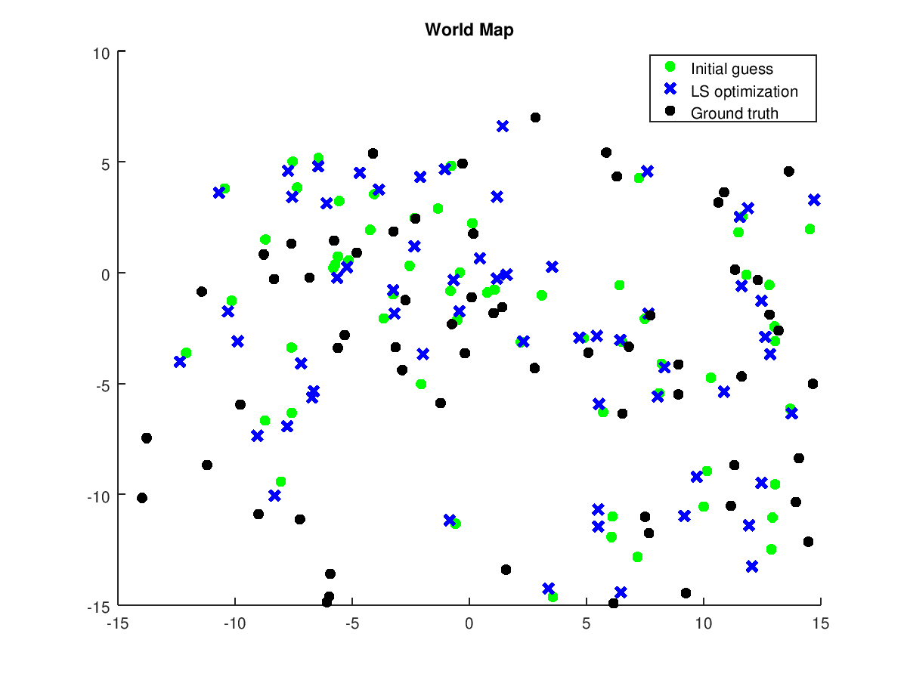
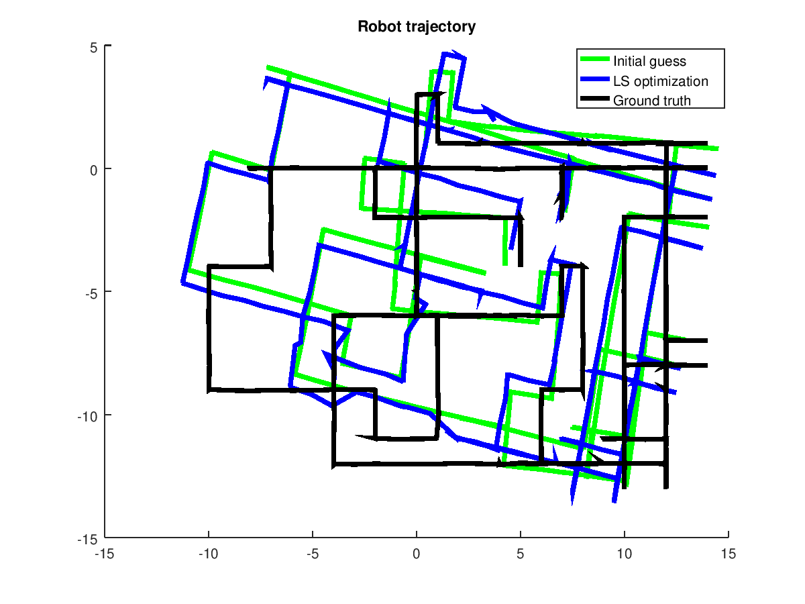
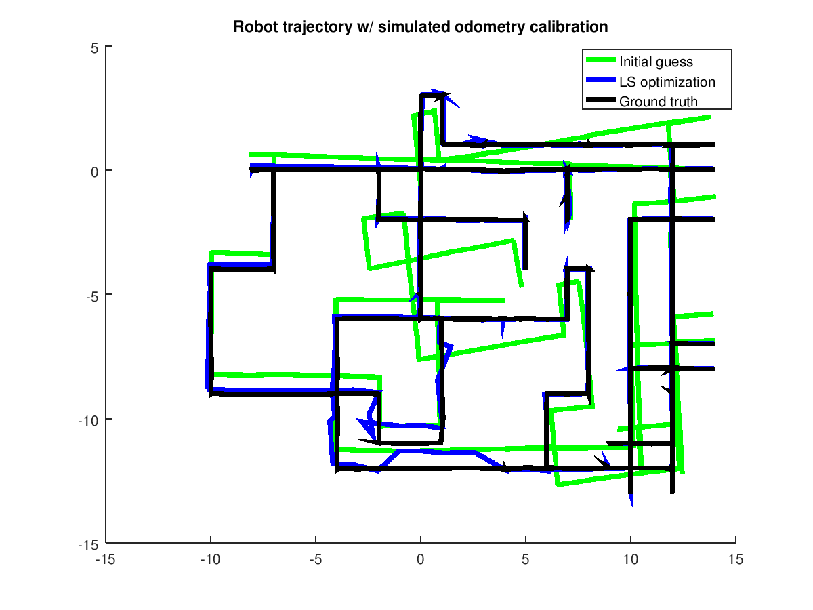

# 2D SLAM using Least Squares Optimization


<p align="center">
  
</p>

## Introduction

Iterative Least Squares (ILS) applications are fairly used in Simultaneous Localization and Mapping (SLAM) systems. This project has the aim of demonstrating a simple ILS solution applied in the context of a differential-drive robot equipped with a range sensor. In particular, the robot is subject to external noises while exploring a 2D world with scattered landmarks. Moreover, landmarks are uniquely identified by an id. This, indeed, simplifies the process of data association. The work consists of finding a map of the world and the trajectory of the moving robot given its poses during time, its observations of the landmarks, and its uncalibrated odometry. Ground truth data is also available for a final performance test of the ILS algorithm. Furthermore, the state is modeled using a manifold and so a topological space that locally resembles Euclidean space near each point. This choice introduces the use of the boxplus operator (further info on this wondrous [work](https://arxiv.org/abs/2002.11051) by Grisetti et al.). The initial guess of landmarks position is computed using classic localization algorithms such as [lateration and minmax](https://www.sciencedirect.com/science/article/pii/S1389128603003566), exploiting noisy range observations of the robot. Landmarks with less than 3 observations were discarded due to the impossibility of finding an adequate estimate. Also, landmarks having a big set of observations with low variance were estimated using only a subset of these last.

## Usage

The whole work is implemented using GNU Octave programming language. Make sure you have a working version of it on your system.

To execute the project simply execute in your terminal:
```shell
octave-cli main.m
```
A set of plots will be generated in the `/plots` folder.


## Results

In this section, it's possible to observe some of the plots showing Least Squares Optimization in action.

This first plot shows the world map containing landmarks. The initial guess of landmarks is obtained by taking robot observations and processing them with lateration algorithm. Due to noisy observation, only part of the landmarks is well guessed or, better saying, near to ground truth.

<p align="center">
  
</p>

Next plot regards the trajectory of the robot moving in the environment while observing the landmarks. The initial guess of robot poses results completely distorted in some areas. This distortion is effectively solved by the least squares optimization. It's observable how the LS trajectory has almost the same shape as the ground truth one and differs in the real world by a simple affine transformation. Indeed, the initial guess of robot poses is constructed using its uncalibrated odometry measurements and its initial position as a prior. This is one of the main causes of this roto-translation of the trajectory.

<p align="center">
  
</p>

Supposing to have a calibrated odometry we would obtain something similar to the next plot. It's quite clear how the ILS algorithm produces a better trajectory w.r.t. the initial guess. It's also possible to notice how the presence of landmarks affects the optimization process. Indeed, in the lower part of the plot, the optimized trajectory results distorted. This is due to a poor presence of landmarks in that area and, maybe, the noisy range measurements on the few present. On the other hand, the optimized trajectory perfectly fits the ground truth one in the areas with a high density of landmarks.

<p align="center">
  
</p>

## Credits
- [Riccardo Caprari](https://github.com/RickyMexx)


*"La Sapienza" University of Rome - MSc in Artificial Intelligence and Robotics*, Probabilistic Robotics 2020/2021
